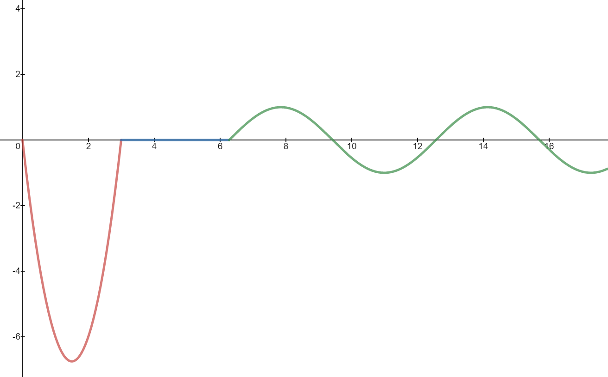

[Back to Notes](/../index.md)

## Example 1

Taking the Laplace transform of

$$
f(t) = \left\{
\begin{array}{l}
3t^2 - 9t &: 0\le t< 3\\
0 &: 3\le t<2\pi\\
\sin(t) &: \pi \le t
\end{array}
\right..
$$

Below is a graph of the function $f$.

The first thing we do is to rewrite the function $f$ in terms of Heaviside functions $u_c$. We also make no distinction between the function $u_0(t)$ and the function which is identically 1.

We will handle this by treating each different part of the function $f$ one at a time (which is why the image above has red, blue and green sections).

The red curve, which is $f(t)$ for $0\le t< 2$, is the function $3t^2-9t$. The Heaviside functions can be viewed as turning on and off a function at specified times. That is $g(t)(u_a - u_b)$ is the function which is $g(t)$ for $a\le t< b$ and $0$ for $0\le t< a$ and 0 for $t\ge b$. Hence the red curve is represented by

$$
\left(3t^2-9t\right)\left(u_0 - u_3\right) = (3t^2-9t)(1-u_3).
$$

The blue curve is just zero so we can represent that by $0(u_3-u_{2\pi}) = 0$. 

The green curve is a sine curve, which is turned on after time $t = 2\pi$ and is never turned off. Therefore, the green part of the curve is represented by

$$
\sin(t) u_{2\pi}.
$$

Hence

$$
f(t) = (3t^2 - 9t)(1-u_{3}) + \sin(t) u_{2\pi}.
$$

In order to easily use the [table](Laplace.Transform.Table.pdf) of Laplace transforms, we must have terms of the form 
$$
g(t-c)u_c.
$$

We now write

$$
f(t) = \left(3t^2-9t\right) + (3t^2-9t)u_3 + \sin(t) u_{2\pi}\\
= f_1(t)  -  f_2(t)u_3 + f_3(t)u_{2\pi}
$$

The Laplace transform of $f_1$ can be read off as

$$
\mathcal{L}(f_1) = \mathcal{L}(3t^2-9t) =  \frac{6}{s^{3}}- \frac{9}{s^2}.
$$

We must now write $f_2(t) = g(t-3)$ in order to easily use the table. If we set $x = t-3$ as a dummy variable, then $t = x+3$ and so we can write

$$
g(x) = g(t-3)\\
=f_2(t)\\
= (3t^2 - 9t)\\
= 3(x+3)^2 - 9(x+3)\\
= 3(x^2+9x+6) - 9(x+3)\\
= 3x^2 + 27 x +18 - 9x - 27\\
= 3x^2+18x - 9.
$$

Again, since $x$ is a dummy variable we can replace $x$ by $t$ at the extreme ends of the above equality

$$
g(t) = 3t^2+18t - 9.
$$

The Laplace transform of this function $g$ can be found in the table and is simply

$$
G(s) = \mathcal{L}(g) = \mathcal{L}(3t^2+18t-9) = \frac{6}{s^3}+ \frac{18}{s^2}- \frac{9}{s}
$$

Hence

$$
\mathcal{L}(f_2(t)u_3) = \mathcal{L}(g(t-3)u_3) = e^{-3s} G(s) = e^{-3s} \left(\frac{6}{s^3}+ \frac{18}{s^2}- \frac{9}{s} \right).
$$

Lastly, to handle the sine term we write

$$
f_3(t) = h(t-2\pi)
$$

and we do a similar change of variable as above. We set $x = t-2\pi$ and then

$$
h(x) = h(t-2\pi)\\
= f_3(t)\\
=\sin(t)\\
= \sin(x+2\pi )\\
=\sin(x),
$$
 

and so $h(t) = \sin(t)$ and

$$
H(s) = \mathcal{L}(h(t)) = \mathcal{L}(\sin(t)) = \frac{1}{s^2+1}.
$$

That means

$$
\mathcal{L}(f_3(t)u_{2\pi}) = \mathcal{L}(h(t-2\pi) u_{2\pi}) = e^{-2\pi s}H(s) = e^{-2\pi s}\frac{1}{s^2+1}.
$$

Combining all the work that we've done yields:

$$
\mathcal{L}({f}) = \frac{6}{s^{3}}- \frac{9}{s^2} -   e^{-3s} \left(\frac{6}{s^3}+ \frac{18}{s^2}- \frac{9}{s} \right) + \frac{e^{-2\pi s}}{s^2+1}
$$
